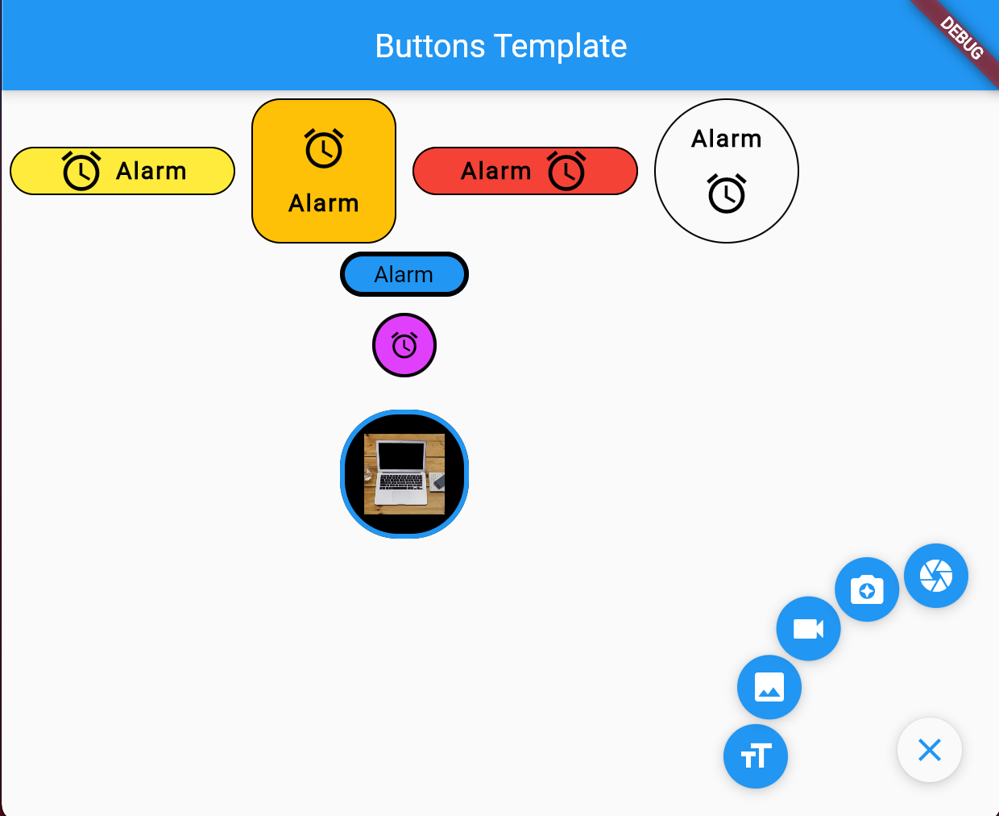

# Flutter Buttons Templates

This template contains some buttons to use inside the front-end.

    Widget btnIconLTextR(Color btnBackground,EdgeInsets paddingBetweenIconText,Color clickColor,Color iconColor,double iconSize,double borderRadius,double borderWidth,Color borderColor,IconData btnIcon,Widget text,Function onPressed) 

    Widget btnIconUTextD(Color btnBackground,EdgeInsets paddingBetweenIconText,Color clickColor,Color iconColor,double iconSize,double borderRadius,double borderWidth,Color borderColor,IconData btnIcon,Widget text,Function onPressed) 

    Widget btnTextLIconR(Color btnBackground,EdgeInsets paddingBetweenIconText,Color clickColor,Color iconColor,double iconSize,double borderRadius,double borderWidth,Color borderColor,IconData btnIcon,Widget text,Function onPressed) 

    Widget btnTextUIconD(Color btnBackground,EdgeInsets paddingBetweenIconText,Color clickColor,Color iconColor,double iconSize,double borderRadius,double borderWidth,Color borderColor,IconData btnIcon,Widget text,Function onPressed) 

    Widget btnText(Color btnBackground, Color clickColor, double borderRadius,double borderWidth, Color borderColor, Widget text, Function onPressed)

    Widget btnIcon(Color btnBackground,Color clickColor,Color iconColor,double iconSize,double borderRadius,double borderWidth,Color borderColor,IconData btnIcon,Function onPressed)

## Variables
Not all buttons contains all varibles.

    Color borderColor: Color used in the border of the button. 
    Color btnBackground: Represent the background color inside of the border.
    Color clickColor: Color that appears when the user makes a click.
    Color iconColor: Color of the icon inserted.
    double borderRadius: 0 or 360 to has a square or circle button (if the width and height of the container that has the buttons is the same).
    double borderWidth: Width of the border. 
    double iconSize: Size of the button.
    Function onPressed: Function that will be executed after the user makes a click.
    IconData btnIcon: IconData widget that will be used.
    EdgeInsets paddingBetweenIconText: EdgeInsets widget that separate the icon and text.
    Widget text: Widget that could be inserted generally is used to insert a text widget. 
    
    

